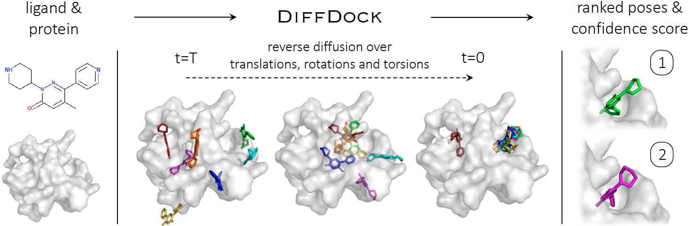

# DiffDock: Diffusion Steps, Twists, and Turns for Molecular Docking

### [Paper on arXiv](https://arxiv.org/abs/2210.01776)

Implementation of DiffDock, state-of-the-art method for molecular docking, by Gabriele Corso*, Hannes Stark*, Bowen Jing*, Regina Barzilay and Tommi Jaakkola.
This repository contains all code, instructions and model weights necessary to run the method or to retrain a model. 
If you have any question, feel free to open an issue or reach out to us: [gcorso@mit.edu](gcorso@mit.edu), [hstark@mit.edu](hstark@mit.edu), [bjing@mit.edu](bjing@mit.edu).

The repository also contains all the scripts to run the baselines and generate the figures.
Additionally, there are visualization videos in `visualizations`.

You might also be interested in this awesome [interactive online tool](https://huggingface.co/spaces/simonduerr/diffdock) by Simon Duerr on Hugging Face for running DiffDock and visualising the predicted structures on your browser, however note that this does not use the optimal hyperparameters for the reverse diffusion which instead are provided below. Instead, Brian Naughton made a [Google Colab notebook](https://colab.research.google.com/drive/1nvCyQkbO-TwXZKJ0RCShVEym1aFWxlkX) to run DiffDock. 

# Dataset

The files in `data` contain the names for the time-based data split.

If you want to train one of our models with the data then: 
1. download it from [zenodo](https://zenodo.org/record/6408497) 
2. unzip the directory and place it into `data` such that you have the path `data/PDBBind_processed`

## Setup Environment

We will set up the environment using [Anaconda](https://docs.anaconda.com/anaconda/install/index.html). Clone the
current repo

    git clone https://github.com/gcorso/DiffDock.git

Create a new environment with all required packages using `environment.yml`. While in the project directory run:

    conda env create

Activate the environment

    conda activate diffdock

If you want to install the packages yourself in case something does not work, these are the required ones:
    
    pytorch
    pyg
    pyyaml
    scipy
    networkx
    biopython
    rdkit-pypi
    e3nn
    spyrmsd
    pandas
    biopandas

# Running DiffDock on your own complexes
We support multiple input formats depending on whether you only want to make predictions for a single complex or for many at once.\
The protein inputs need to be .pdb files. The ligand input can either be a SMILES string or a filetype that RDKit can read like `.sdf` or `.mol2`.

For a single complex: specify the protein with, e.g., `--protein_path protein.pdb` and the ligand with `--ligand ligand.sdf` or `--ligand "COc(cc1)ccc1C#N"`

For many complexes: create a csv file with paths to proteins and ligand files or SMILES. The first column of the .csv has to be called `protein_path` and the second one `ligand`.
An example .csv is at `data/protein_ligand_example_csv.csv` and you would use it with `--protein_ligand_csv protein_ligand_example_csv.csv`.

### Generate the ESM2 embeddings for the proteins
We will soon also provide weights of a trained model without ESM2 embeddings such that this step is not necessary. Luckily, it is rather easy. First prepare a fasta for ESM2 (for a single protein use `--protein_path protein.pdb` instead):

    python datasets/esm_embedding_preparation.py --protein_ligand_csv data/protein_ligand_example_csv.csv --out_file data/prepared_for_esm.fasta 
    
Generate the embeddings with ESM2 (assuming that you are in the DiffDock directory):

    git clone https://github.com/facebookresearch/esm
    cd esm
    pip install -e .
    cd ..
    HOME=esm/model_weights python esm/scripts/extract.py esm2_t33_650M_UR50D data/prepared_for_esm.fasta data/esm2_output --repr_layers 33 --include per_tok
    
And done, that is it!

### Run inference

    python -m inference --protein_ligand_csv data/protein_ligand_example_csv.csv --out_dir results/user_predictions_small --inference_steps 20 --samples_per_complex 40 --batch_size 10 --actual_steps 18 --no_final_step_noise

# Running DiffDock to reproduce paper numbers
Download the data and place it as described in the "Dataset" section above.

### Generate the ESM2 embeddings for the proteins
First run:

    python datasets/pdbbind_lm_embedding_preparation.py

Use the generated file `data/pdbbind_sequences.fasta` to generate the ESM2 language model embeddings using the library https://github.com/facebookresearch/esm by installing their repository and executing the following in their repository:

    python scripts/extract.py esm2_t33_650M_UR50D pdbbind_sequences.fasta embeddings_output --repr_layers 33 --include per_tok

This generates the `embeddings_output` directory which you have to copy into the `data` folder of our repository to have `data/embeddings_output`.
Then run the command:

    python datasets/esm_embeddings_to_pt.py

### Using the provided model weights for evaluation
We first generate the language model embeddings for the testset, then run inference with DiffDock, and then evaluate the files that DiffDock produced:

    python datasets/esm_embedding_preparation.py --protein_ligand_csv data/testset_csv.csv --out_file data/prepared_for_esm_testset.fasta
    git clone https://github.com/facebookresearch/esm 
    cd esm
    pip install -e .
    cd ..
    HOME=esm/model_weights python esm/scripts/extract.py esm2_t33_650M_UR50D data/prepared_for_esm_testset.fasta data/esm2_output --repr_layers 33 --include per_tok
    python -m inference --protein_ligand_csv data/testset_csv.csv --out_dir results/user_predictions_testset --inference_steps 20 --samples_per_complex 40 --batch_size 10 --actual_steps 18 --no_final_step_noise
    python evaluate_files.py --results_path results/user_predictions_testset --file_to_exclude rank1.sdf --num_predictions 40

<!--
To predict binding structures using the provided model weights run: 

    python -m evaluate --model_dir workdir/paper_score_model --ckpt best_ema_inference_epoch_model.pt --confidence_ckpt best_model_epoch75.pt --confidence_model_dir workdir/paper_confidence_model --run_name DiffDockInference --inference_steps 20 --split_path data/splits/timesplit_test --samples_per_complex 40 --batch_size 10 --actual_steps 18 --no_final_step_noise

To additionally save the .sdf files of the generated molecules, add the flag `--save_visualisation`
-->
### Training a model yourself and using those weights
Train the large score model:

    python -m train --run_name big_score_model --test_sigma_intervals --esm_embeddings_path data/esm2_3billion_embeddings.pt --log_dir workdir --lr 1e-3 --tr_sigma_min 0.1 --tr_sigma_max 19 --rot_sigma_min 0.03 --rot_sigma_max 1.55 --batch_size 16 --ns 48 --nv 10 --num_conv_layers 6 --dynamic_max_cross --scheduler plateau --scale_by_sigma --dropout 0.1 --remove_hs --c_alpha_max_neighbors 24 --receptor_radius 15 --num_dataloader_workers 1 --cudnn_benchmark --val_inference_freq 5 --num_inference_complexes 500 --use_ema --distance_embed_dim 64 --cross_distance_embed_dim 64 --sigma_embed_dim 64 --scheduler_patience 30 --n_epochs 850

The model weights are saved in the `workdir` directory.

Train a small score model with higher maximum translation sigma that will be used to generate the samples for training the confidence model:

    python -m train --run_name small_score_model --test_sigma_intervals --esm_embeddings_path data/esm2_3billion_embeddings.pt --log_dir workdir --lr 1e-3 --tr_sigma_min 0.1 --tr_sigma_max 34 --rot_sigma_min 0.03 --rot_sigma_max 1.55 --batch_size 16 --ns 24 --nv 6 --num_conv_layers 5 --dynamic_max_cross --scheduler plateau --scale_by_sigma --dropout 0.1 --remove_hs --c_alpha_max_neighbors 24 --receptor_radius 15 --num_dataloader_workers 1 --cudnn_benchmark --val_inference_freq 5 --num_inference_complexes 500 --use_ema --scheduler_patience 30 --n_epochs 300

In practice, you could also likely achieve the same or better results by using the first score model for creating the samples to train the confidence model, but this is what we did in the paper.  
The score model used to generate the samples to train the confidence model does not have to be the same as the score model that is used with that confidence model during inference.

Train the confidence model by running the following:

    python -m confidence.confidence_train --original_model_dir workdir/small_score_model --run_name confidence_model --inference_steps 20 --samples_per_complex 7 --batch_size 16 --n_epochs 100 --lr 3e-4 --scheduler_patience 50 --ns 24 --nv 6 --num_conv_layers 5 --dynamic_max_cross --scale_by_sigma --dropout 0.1 --all_atoms --remove_hs --c_alpha_max_neighbors 24 --receptor_radius 15 --esm_embeddings_path data/esm2_3billion_embeddings.pt --main_metric loss --main_metric_goal min --best_model_save_frequency 5 --rmsd_classification_cutoff 2 --cache_creation_id 1 --cache_ids_to_combine 1 2 3 4

first with `--cache_creation_id 1` then `--cache_creation_id 2` etc. up to 4

Now everything is trained and you can run inference with:

    python -m evaluate --model_dir workdir/big_score_model --ckpt best_ema_inference_epoch_model.pt --confidence_ckpt best_model_epoch75.pt --confidence_model_dir workdir/confidence_model --run_name DiffDockInference --inference_steps 20 --split_path data/splits/timesplit_test --samples_per_complex 40 --batch_size 10 --actual_steps 18 --no_final_step_noise

## Citation
    @article{corso2022diffdock,
          title={DiffDock: Diffusion Steps, Twists, and Turns for Molecular Docking}, 
          author = {Corso, Gabriele and Stärk, Hannes and Jing, Bowen and Barzilay, Regina and Jaakkola, Tommi},
          journal={arXiv preprint arXiv:2210.01776},
          year={2022}
    }

## License
MIT

